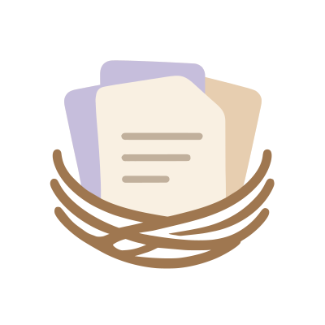

<div align="center">



# Clipnest — a fast, private clipboard manager for Mac

**Never lose a copy again.** Clipnest is a lightweight, native **macOS clipboard manager** that quietly remembers everything you copy — text, links, images, and files — and hands it back the instant you need it. Hit a hotkey, search, paste. Plus reusable **snippets** you can expand by keyword in any app.

[](#requirements)
[](#how-its-built)
[](#privacy-first)
[](LICENSE)

</div>

---

## Why Clipnest?

macOS only remembers the **last** thing you copied. Copy something new and the old one is gone forever — the link you needed, the code snippet, the address you just had. A good **clipboard history manager** fixes that, and once you have one you'll wonder how you lived without it.

Clipnest is built to be the one you actually keep running: **native, tiny, instant, and completely private.** No Electron, no web view, no account, no cloud, no telemetry. Just a clean menu-bar app that does one job extremely well.

> Looking for a **free, open-source clipboard manager for Mac** — a lightweight alternative to Paste, Maccy, or Pastebot? Clipnest is a fresh, from-scratch take built in pure SwiftUI.

## Features

- 📋 **Full clipboard history** — automatically captures everything you copy: plain text, rich text, URLs, images, and files.
- ⚡ **Global hotkey** — press **⌥⌘V** anywhere to pop the picker open right at your cursor, over any app (even full-screen).
- 🔎 **Instant search** — start typing to filter your entire copy-paste history in real time, with matches highlighted.
- 🏷 **Type filters** — narrow the list to just text, images, files, or links with one click.
- 🗂 **Tabs** — **History**, **Pinned**, and **Snippets**, switchable with ⌘1 / ⌘2 / ⌘3.
- ↩︎ **Paste into your active app** — pick an item and, with Accessibility granted, Clipnest types it straight into the field you were using; otherwise it's placed on your clipboard to paste yourself.
- 🅰 **Paste without formatting** — **⌥Return** strips rich text down to plain; **Return** keeps basic formatting when the source had it.
- 👁 **Hover previews** — hover (or arrow to) an item and a popover shows the full content: the image at up to 40% of screen width, the full scrollable text (loaded in chunks for huge clips), or a file's name, size, and path.
- 📌 **Pin your favorites** — keep the items you reuse most pinned to the top, always a keystroke away.
- 🧠 **Smart de-duplication** — copy the same thing twice and it won't clutter your history.
- ✂️ **Snippets** — save reusable text (a signature, boilerplate, a command) with a **Tag**, and paste it from the Snippets tab or **expand it by keyword in any app** (see below). Turn any history item into a snippet with **⌘S**.
- ⌨️ **Keyboard-first** — arrows to move, Return to paste, Esc to dismiss, ⌘F to search, ⌘P to pin, ⌘⌫ to delete, ⌘1/2/3 for tabs.
- 🪶 **Featherweight & native** — pure Swift/SwiftUI, a few MB, sips almost no memory, feels like part of macOS. Lives in the menu bar, no Dock clutter.
- 🔒 **Private by design** — everything stays on your Mac. See [Privacy](#privacy-first).

## Snippets & keyword expansion

Snippets are reusable bits of text you author yourself (unlike captured history). Create one in the **Snippets** tab (⌘N) or save any history item as a snippet (⌘S). Each snippet has a **Tag** (its name — also its expansion keyword) and a **Body** (what gets pasted).

**Expand anywhere:** type a snippet's Tag in *any* app, select it, and press **⌥⌘E** — Clipnest replaces the selection with the snippet's Body.

It works in **every** application, using a two-tier approach:

1. **Accessibility first** — in native / most Cocoa text fields, it reads and replaces the selection directly, without ever touching your clipboard.
2. **Clipboard fallback** — where the Accessibility API can't read the selection (Electron/Chrome apps like VS Code, Slack), it synthesizes copy/paste — which every app supports — while **snapshotting and restoring your clipboard** so it's left exactly as it was, and suppressing Clipnest's own capture of the transient copy/paste.

No keyword match, or nothing selected → a gentle system beep, nothing changed.

## Privacy first

Your clipboard is some of the most sensitive data on your machine — passwords, tokens, private messages. Clipnest treats it that way:

- **100% local.** Nothing ever leaves your Mac. No servers, no sync, no analytics, no network calls at all.
- **Password managers are ignored.** Clipnest honors the standard "concealed" and "transient" clipboard markers, so copies from 1Password, Bitwarden, and friends are never stored — a rule no setting can override.
- **No content in logs.** Only metadata (ids, error cases) is ever logged, never clipboard or snippet contents.
- **You're in control.** Delete any entry on the spot with `⌘⌫`. (A pause-capture toggle and one-click clear-all are on the [roadmap](#roadmap), landing with the Settings window.)

## Requirements

- macOS 14 (Sonoma) or later
- Apple Silicon or Intel
- Xcode 16+ (Swift 6 toolchain) to build from source
- **Accessibility** permission (optional) — only needed for pasting into other apps and snippet expansion; capturing and searching work without it.

## Install

### Download (recommended)

Grab the latest signed, notarized `.dmg` from the [**Releases**](../../releases) page, drag Clipnest to your Applications folder, and launch it. *(The release pipeline that builds, signs, and notarizes that `.dmg` is documented in [Release](#release) — the first signed build depends on the maintainer's own Apple Developer account being wired up.)*

### Build from source

```bash
# 1. Tooling (one-time)
brew install xcodegen        # requires Xcode 16+ installed

# 2. Clone
git clone https://github.com/<your-username>/clipnest.git
cd clipnest

# 3. Test the core logic (no Xcode project needed — pure Swift package)
swift test

# 4. Generate the Xcode project and build the app
cd ClipnestApp
xcodegen generate
xcodebuild -project ClipnestApp.xcodeproj -scheme ClipnestApp \
  -configuration Debug CODE_SIGNING_ALLOWED=NO build

# 5. Run it
open DerivedData/Build/Products/Debug/Clipnest.app   # if built with -derivedDataPath DerivedData
```

On first launch, grant Clipnest **Accessibility** access (System Settings → Privacy & Security → Accessibility) so it can paste into other apps and expand snippets. Everything else works without it. Because unsigned dev builds get a fresh code identity each rebuild, macOS may ask you to re-grant Accessibility after rebuilding.

## Usage

1. Clipnest lives in your **menu bar** — no Dock clutter.
2. Copy things like you normally would; Clipnest remembers them.
3. Press **⌥⌘V** (or click the menu-bar icon → *Open Clipnest*) to open the picker at your cursor.
4. **Type** to search, **↑/↓** to move, **Return** to paste into whatever you were doing.
5. **Pin** the ones you reuse most, save handy text as **Snippets**, and expand them anywhere with **⌥⌘E**.

### Keyboard shortcuts

| Action | Shortcut |
| --- | --- |
| Open Clipnest | `⌥⌘V` |
| Expand snippet by Tag (in any app) | `⌥⌘E` |
| Search | `⌘F` |
| Move selection | `↑` / `↓` |
| Paste selected | `Return` |
| Paste without formatting | `⌥Return` |
| Pin / unpin | `⌘P` |
| Save history item as snippet | `⌘S` |
| New snippet (Snippets tab) | `⌘N` |
| Delete entry | `⌘⌫` |
| Switch tabs (History / Pinned / Snippets) | `⌘1` / `⌘2` / `⌘3` |
| Close | `Esc` |

## How it's built

Clipnest is intentionally boring in the best way — a small, well-tested native codebase split into a pure-logic package and a thin UI shell:

- **Swift 6 + SwiftUI/AppKit**, minimum macOS 14. Menu-bar app (`LSUIElement`, no Dock icon).
- **`ClipnestCore`** — a dependency-light Swift package holding *all* the logic (capture, privacy filtering, storage, search, paste, snippet expansion). Fully unit-tested with Swift Testing — runnable on its own with `swift test`, no Xcode project required.
- **`ClipnestApp`** — the SwiftUI/AppKit frontend (menu bar, the non-activating floating picker panel, hover-preview popover, snippet editor window). Generated with [XcodeGen](https://github.com/yonyz/XcodeGen) from `ClipnestApp/project.yml`.
- **Persistence:** **SwiftData** for metadata; a content-addressed **blob store** on disk for image/rich-text bytes (deduped by SHA-256), so the database stays small.
- **Capture:** macOS has no "pasteboard changed" event, so a lightweight `changeCount` poll detects new copies; a live hook pushes them straight into the picker.
- **Paste & expansion:** synthesized ⌘V via `CGEvent`; snippet expansion uses an **Accessibility path** with a **clipboard-with-restore fallback** so it works in every app (see [Snippets](#snippets--keyword-expansion)).
- **Focus-safe UI:** the picker is a non-activating `NSPanel` so it never steals keyboard focus from the app you were using; the preview popover is a separate non-key panel beside it.
- **One dependency:** [`KeyboardShortcuts`](https://github.com/sindresorhus/KeyboardShortcuts) (MIT) for global-hotkey registration. Everything else is system frameworks.

Extending Clipnest or building your own frontend on top of `ClipnestCore`? See **[`docs/API.md`](docs/API.md)** for the public API reference.

### Project structure

```
.
├── Package.swift               # ClipnestCore Swift package (logic + tests)
├── Sources/ClipnestCore/
│   ├── Model/                  # ClipItem, Snippet, ItemKind (+ preview eligibility)
│   ├── Clipboard/              # ClipboardMonitor, PasteboardReader, PrivacyFilter
│   ├── Store/                  # ClipStore/SnippetStore protocols, SwiftData + in-memory impls, BlobStore
│   ├── Search/                 # SearchQuery, SearchHighlighter
│   └── Paste/                  # Paster, EventSynthesizing, SnippetExpander, SelectedTextAccessing, SelectionReplacing
├── Tests/ClipnestCoreTests/    # Swift Testing suites for the whole core
├── ClipnestApp/
│   ├── project.yml             # XcodeGen project definition
│   ├── Resources/Assets.xcassets   # AppIcon + MenuBarIcon
│   └── Sources/
│       ├── App/                # @main, AppDelegate, AppEnvironment (composition root)
│       ├── System/             # HotkeyManager, PermissionsManager, AX + clipboard selection replacers
│       └── UI/Picker/          # PickerPanel/View/ViewModel, rows, previews, snippet editor
├── assets/clipnest-icons/      # Source logo/icon SVGs (master + treatments)
├── scripts/                    # build / sign / notarize / package-dmg (release pipeline)
└── docs/                       # API reference + design specs & implementation plans
```

## Release

The `.dmg` on the [Releases](../../releases) page is produced by four small, chained shell scripts in [`scripts/`](scripts/) — no CI platform, just local scripts anyone with a Developer ID can run:

```bash
scripts/build.sh                 # xcodegen generate → xcodebuild archive → exports Clipnest.app to build/
scripts/sign.sh   "<identity>"   # codesign --sign "<identity>" build/Clipnest.app
scripts/notarize.sh "<profile>"  # zips, submits to notarytool --wait, staples the ticket
scripts/package_dmg.sh           # wraps create-dmg (or an hdiutil fallback) → build/Clipnest.dmg
```

`build.sh` never needs a signing identity — it always produces a runnable `build/Clipnest.app` on its own, so it's safe to run at any time. `sign.sh` and `notarize.sh` genuinely need a Developer ID:

- **`sign.sh`** takes the codesign identity as its first argument or `$CODESIGN_IDENTITY` — never hardcoded. Find yours with `security find-identity -v -p codesigning`.
- **`notarize.sh`** takes an `xcrun notarytool` keychain profile name as its first argument or `$NOTARY_PROFILE`. Set it up **once**, out-of-band, so credentials live in your login keychain, never in this repo:
  ```bash
  xcrun notarytool store-credentials "<profile-name>" \
    --apple-id "<your-apple-id>" --team-id "<TEAMID>" --password "<app-specific-password>"
  ```
- `ClipnestApp/project.yml`'s Release config reads `DEVELOPMENT_TEAM` / `CODE_SIGN_IDENTITY` from the environment (via XcodeGen `${VAR}` expansion), so exporting `DEVELOPMENT_TEAM` before `scripts/build.sh` yields a proper `developer-id` export.

None of this requires an Apple Developer account to build and run Clipnest from source — it's only needed to produce a Gatekeeper-clean, distributable `.dmg`.

## Roadmap

- [x] Reusable snippets + keyword expansion in any app
- [x] Paste without formatting
- [x] Hover previews for images, long text, and files
- [ ] Notarized `.dmg` release + auto-updates (Sparkle)
- [ ] Settings window: pause capture, clear-all history, custom hotkey rebinding, launch-at-login, excluded apps
- [ ] Configurable retention (keep N days / N items)
- [ ] macOS Shortcuts (App Intents) actions

## Contributing

Issues, ideas, and pull requests are welcome. Clipnest is a small, readable codebase built to be hacked on — clone it, run `swift test`, and dive in. The core logic has no Xcode dependency, so most contributions can be developed and tested from the command line.

## License

Clipnest is released under the [MIT License](LICENSE) — free to use, modify, and share.

---

<div align="center">
<sub><strong>Clipnest</strong> · a free, open-source, native clipboard history manager for macOS · clipboard manager · copy-paste history · snippets & text expansion · Mac productivity</sub>
</div>
