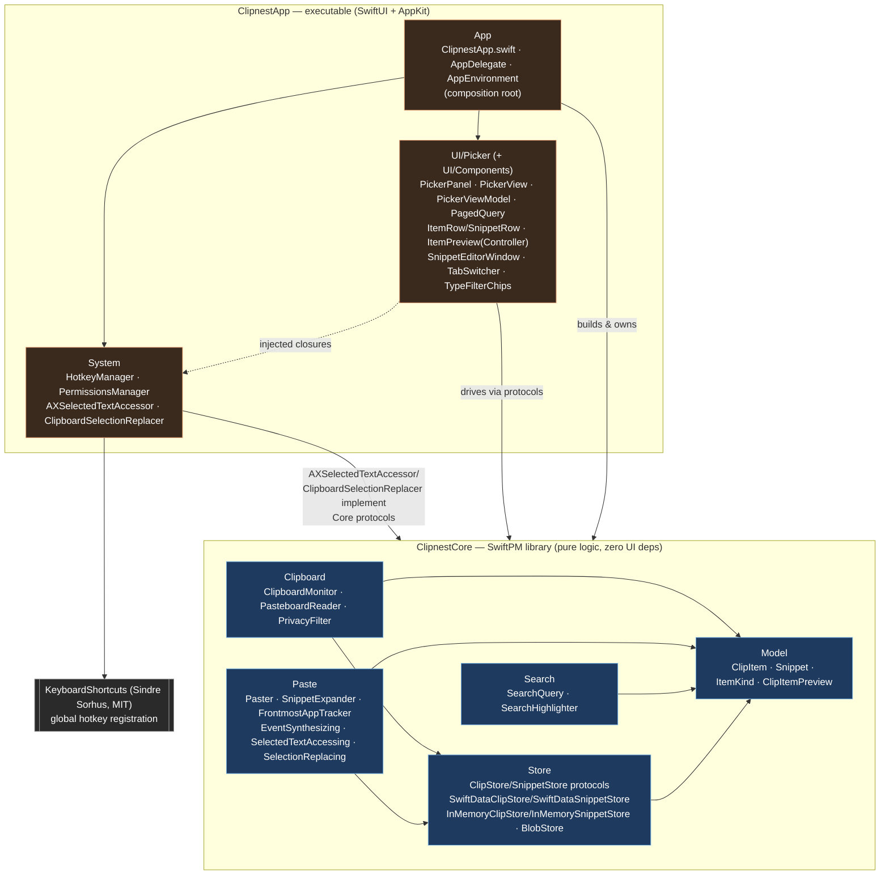
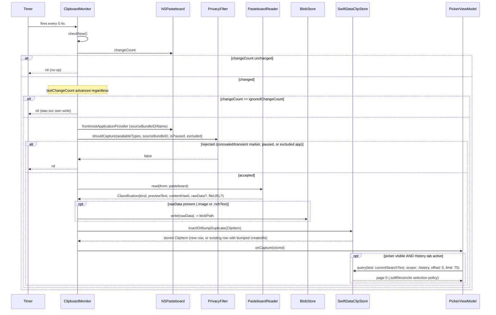
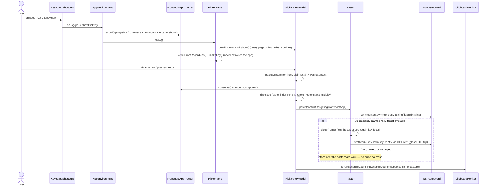
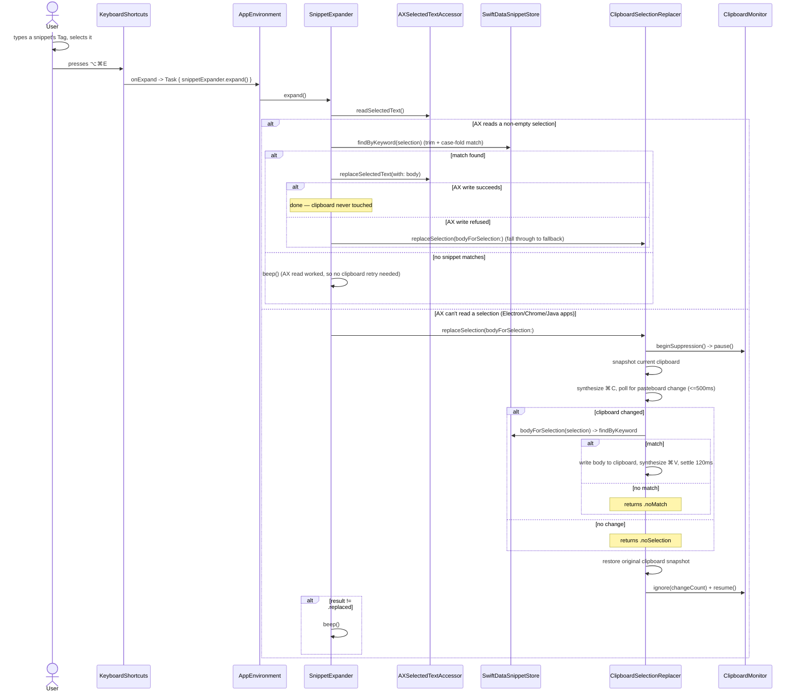
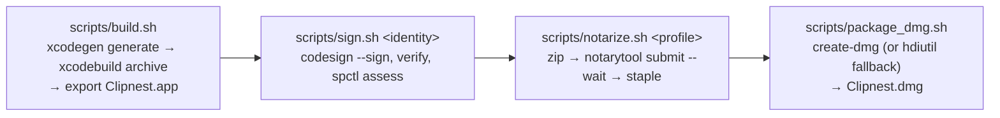

# Clipnest — Architecture

Clipnest is a native macOS menu-bar clipboard manager and snippet expander. This document explains how the codebase is put together — module boundaries, runtime data flows, persistence, concurrency, dependency injection, and the release pipeline — grounded in the actual source, with `file:line` citations for load-bearing claims. It complements [`docs/API.md`](API.md) (the `ClipnestCore` API reference) rather than duplicating it; where the two could be read as disagreeing (see the [Store module](#store) note on `ClipStore.query`), this document reflects the code as it stands today.

## Table of contents

1. [Overview](#1-overview)
2. [High-level architecture](#2-high-level-architecture)
3. [Module reference](#3-module-reference)
   - [3.1 `ClipnestCore`](#31-clipnestcore)
   - [3.2 `ClipnestApp`](#32-clipnestapp)
4. [Runtime data flows](#4-runtime-data-flows)
5. [Persistence & data model](#5-persistence--data-model)
6. [Concurrency model](#6-concurrency-model)
7. [Dependency injection](#7-dependency-injection)
8. [Build, packaging & release](#8-build-packaging--release)
9. [External dependencies](#9-external-dependencies)
10. [Extension points & known constraints](#10-extension-points--known-constraints)

---

## 1. Overview

Clipnest continuously watches the system pasteboard, captures what you copy (text, rich text, links, images, files), and lets you search and re-paste it from a global-hotkey picker. It also supports user-authored **snippets** — reusable text expandable by keyword in any app.

**Design philosophy**, as encoded in the source and `.claude/coding-standards.md`:

- **Local-only, always.** No networking code exists anywhere in the tree — no `URLSession`, no sockets, no analytics. Everything captured stays in `~/Library/Application Support/Clipnest`.
- **Protocol-oriented, for testability.** Every side-effecting capability (`ClipStore`, `SnippetStore`, `PasteboardReading`/`PasteboardWriting`, `EventSynthesizing`, `SelectedTextAccessing`, `SelectionReplacing`, `FrontmostApplicationProviding`) is a protocol with a real production implementation and an in-memory/mock test double. `ClipnestCoreTests` never touches a real pasteboard, real key events, or real disk.
- **Core/App separation.** `ClipnestCore` (Sources/ClipnestCore/) is a pure-logic SwiftPM library with zero SwiftUI/AppKit dependency, 176 `@Test` functions, runnable via plain `swift test` — no Xcode project required. `ClipnestApp` (ClipnestApp/) is a thin SwiftUI/AppKit shell that depends on it; dependency direction is one-way (Core never imports anything App-side).
- **Privacy as an unbypassable invariant, not a setting.** `PrivacyFilter` rejects clipboard content carrying the `org.nspasteboard.ConcealedType`/`TransientType` markers, or originating from a built-in list of password-manager bundle IDs — unconditionally; no parameter or user setting can override this (`Sources/ClipnestCore/Clipboard/PrivacyFilter.swift:46-69`).

**Tech stack** (verified from `Package.swift` and `ClipnestApp/project.yml`):

| | |
|---|---|
| Language | Swift 6 (`swift-tools-version: 6.0`, `SWIFT_VERSION: "6.0"`) — strict concurrency throughout `ClipnestCore` |
| UI | SwiftUI, with AppKit interop (`NSPanel`, `NSWindow`, `MenuBarExtra`, `CGEvent`) where SwiftUI has no coverage |
| Persistence | SwiftData (metadata) + a content-addressed on-disk blob store (large payloads) |
| Minimum macOS | **14.0 (Sonoma)** — `Package.swift:6` (`platforms: [.macOS(.v14)]`) and `ClipnestApp/project.yml:5,26` (`deploymentTarget.macOS: "14.0"`, target `deploymentTarget: "14.0"`) |
| App type | Menu-bar-only (`LSUIElement`) — no Dock icon, no main window |
| Third-party dependencies | Exactly one: [`KeyboardShortcuts`](https://github.com/sindresorhus/KeyboardShortcuts) (MIT), `ClipnestApp`-only |

---

## 2. High-level architecture

Two build targets, one dependency direction: `ClipnestApp` depends on `ClipnestCore`; `ClipnestCore` depends on nothing in the tree.



Nothing in `ClipnestCore` imports SwiftUI, AppKit-UI, or `ClipnestApp`. Where a capability needs a concrete AppKit-backed implementation (Accessibility text access, the clipboard-based snippet-expansion fallback), the **protocol** lives in Core and the **concrete type** lives in `ClipnestApp/Sources/System/` — e.g. `SelectedTextAccessing` is declared at `Sources/ClipnestCore/Paste/SelectedTextAccessing.swift:7` and implemented by `AXSelectedTextAccessor` at `ClipnestApp/Sources/System/SelectedTextAccessing.swift:20`.

---

## 3. Module reference

### 3.1 `ClipnestCore`

#### Model — `Sources/ClipnestCore/Model/`

Plain `Sendable` value types with no persistence-framework knowledge — SwiftData never appears here.

| Type | File | Responsibility |
|---|---|---|
| `ClipItem` | `Model/ClipItem.swift:14-69` | One captured clipboard entry: `id`, `createdAt`, `kind: ItemKind`, `previewText`, `contentHash`, `pinned`/`pinnedAt`, `sourceAppName`/`sourceBundleID`, `byteSize`, `blobPath?`, `fileReference?`. |
| `ItemKind` | `Model/ItemKind.swift:8-14` | `.text \| .richText \| .link \| .image \| .file`. |
| `Snippet` | `Model/Snippet.swift:8-28` | User-authored reusable text: `id`, `title` (the picker's "Tag" field), `body`, `keyword?`, `createdAt`. |
| `ClipItem.isPreviewWorthy` | `Model/ClipItemPreview.swift:9-21` | Pure predicate (all kinds `true` today) deciding whether a row gets a hover popover — kept in Core so it's unit-testable without the UI. |

`ClipItem.pinnedAt` is `nil` iff `pinned == false`; it is written only by `ClipStore.setPinned(_:pinned:)`, never constructed directly by capture (`Model/ClipItem.swift:21-30`).

#### Clipboard — `Sources/ClipnestCore/Clipboard/`

| Type | File | Responsibility |
|---|---|---|
| `ClipboardMonitor` | `Clipboard/ClipboardMonitor.swift:54-280` | `@MainActor` poll loop over `NSPasteboard.changeCount` (macOS has no pasteboard-changed push event). Owns the whole capture pipeline: filter → classify → write blob (off-main) → store. |
| `PasteboardReader` | `Clipboard/PasteboardReader.swift:26-206` | Pure classifier: pasteboard contents → `Classification(kind, previewText, contentHash, byteSize, rawData?, fileURL?)`. Never touches disk or `BlobStore`. |
| `PrivacyFilter` | `Clipboard/PrivacyFilter.swift:10-70` | The capture gate — see [Overview](#1-overview). |

Key API surface:
- `ClipboardMonitor.defaultPollInterval = 0.4` seconds (`Clipboard/ClipboardMonitor.swift:57`).
- `checkNow() async -> ClipItem?` — the deterministic, test-driven entry point; `start()`/`stop()` wrap it in a real `Timer` (`Clipboard/ClipboardMonitor.swift:148-165, 202-279`).
- `pause()`/`resume()`/`isPaused` — `checkNow()` no-ops while paused (`Clipboard/ClipboardMonitor.swift:168-175`).
- `ignore(changeCount:)` — tells the monitor a given pasteboard `changeCount` was Clipnest's own write (copy-on-select, a synthesized paste, the snippet-expansion clipboard fallback), so the next poll doesn't recapture it as an external copy (`Clipboard/ClipboardMonitor.swift:177-194`).
- `onCapture: (ClipItem) -> Void` — a plain (non-`Sendable`) stored closure, safe because the whole class is `@MainActor`; lets the composition root push a live update into the picker instead of the picker polling the store (`Clipboard/ClipboardMonitor.swift:108-121`).
- `PasteboardReader.read(from:)` checks pasteboard types in **priority order** — `.fileURL` → image (`.tiff`/`.png`) → `.rtf` → `.string` — because a single copy commonly carries multiple representations at once and a generic type must never win over a more specific one present on the same pasteboard (`Clipboard/PasteboardReader.swift:72-104`).
- `Classification.rawData` is populated for **both** `.image` and `.richText` (raw RTF bytes) — `readImage`/`readRichText` both set it (`Clipboard/PasteboardReader.swift:116-124, 155-167`); `.text`/`.link`/`.file` never carry `rawData`.

`ClipboardMonitor` collaborates with `PrivacyFilter` (gate), `PasteboardReader` (classify), `BlobStore` (persist `rawData` for `.image`/`.richText`), and `ClipStore` (persist the resulting `ClipItem`) — see [§4.1](#41-copy--capture--classify--filter--store).

#### Paste — `Sources/ClipnestCore/Paste/`

| Type | File | Responsibility |
|---|---|---|
| `Paster` | `Paste/Paster.swift:136-210` | Writes `PasteContent` to the pasteboard, then — only if Accessibility is granted and a target is available — synthesizes ⌘V into the previously-frontmost app. |
| `FrontmostAppTracker` | `Paste/FrontmostAppTracker.swift:55-79` | `@MainActor`. `record()`/`consume()` bridge "who was frontmost when the picker was about to open" to "who receives the synthesized paste." |
| `SnippetExpander` | `Paste/SnippetExpander.swift:28-89` | `@MainActor`. Backs the global ⌥⌘E hotkey: AX-first selection read/replace, clipboard-with-restore fallback. |
| `EventSynthesizing` (protocol) | `Paste/EventSynthesizing.swift:12-17` | Injectable ⌘V synthesis; real impl `CGEventSynthesizer` in `Paster.swift:91-126`. |
| `SelectedTextAccessing` (protocol) | `Paste/SelectedTextAccessing.swift:7-16` | Injectable AX-backed selection read/replace; real impl `AXSelectedTextAccessor` lives in `ClipnestApp` (App-only concrete type behind a Core protocol). |
| `SelectionReplacing` (protocol) | `Paste/SelectionReplacing.swift:38-45` | `@MainActor` protocol for the universal clipboard-borrow-and-restore fallback; real impl `ClipboardSelectionReplacer` lives in `ClipnestApp`. |

`PasteContent` (`Paste/Paster.swift:27-32`) has **four** cases — `.text(String)`, `.image(Data)`, `.file(URL)`, `.richText(rtf: Data, plain: String)` — the last of which post-dates `docs/API.md`'s documented three-case enum; `Paster.paste(_:targetingFrontmostApp:)` (`Paste/Paster.swift:179-209`) handles all four, writing both `.rtf` and `.string` representations for `.richText` via `PasteboardWriting.writeRichText(rtf:plain:)` (`Paste/Paster.swift:56-59, 78-82`).

`Paster.paste` degrades **silently** (no error, no crash) to "pasteboard write only" when Accessibility isn't granted or no target is available — this is the documented, permanent fallback, not a bug (`Paste/Paster.swift:166-178`). The pasteboard write itself happens synchronously before any suspension point, so a caller can read `pasteboard.changeCount` immediately after `paste` returns and observe the correct value (`Paste/Paster.swift:173-178`).

`SnippetExpander.expand()` tries `SelectedTextAccessing` first (no clipboard side effect); on failure to read a selection, or a refused write, it falls through to `SelectionReplacing` (`Paste/SnippetExpander.swift:62-88`) — see [§4.3](#43-snippet-keyword-typed--detected--expanded).

#### Search — `Sources/ClipnestCore/Search/`

| Type | File | Responsibility |
|---|---|---|
| `SearchQuery` | `Search/SearchQuery.swift:9-17` | `text: String`, `kindFilter: ItemKind?` — the shape of a picker search. |
| `SearchHighlighter` | `Search/SearchHighlighter.swift:11-32` | `matchRanges(in:matching:)` — every non-overlapping, case-insensitive match range, earliest-first. Pure range-finding; `ClipnestApp/Sources/UI/Picker/HighlightedText.swift` turns ranges into a styled `AttributedString`. |

Note: `docs/API.md` also documents an in-memory `SearchFilter`/`SnippetSearchFilter`. Those types no longer exist in `Sources/ClipnestCore/Search/` — real filtering/sorting/pagination moved into the store layer (`ClipStore.query`/`SnippetStore.query`, see below) as part of the T49–T51 "DB-virtualization" change; `SearchHighlighter` is the one piece of that pre-existing design that's unchanged and still in active use (`ClipnestApp/Sources/UI/Picker/PickerViewModel.swift:18-36`).

#### Store — `Sources/ClipnestCore/Store/`

| Type | File | Responsibility |
|---|---|---|
| `ClipStore` (protocol) | `Store/ClipStore.swift:35-86` | CRUD + dedup + query over clipboard history. |
| `SnippetStore` (protocol) | `Store/SnippetStore.swift:16-45` | CRUD + query over snippets. |
| `SwiftDataClipStore` | `Store/SwiftDataClipStore.swift:22-473` | Production `ClipStore`, SwiftData-backed. |
| `SwiftDataSnippetStore` | `Store/SwiftDataSnippetStore.swift:9-298` | Production `SnippetStore`, SwiftData-backed. |
| `ModelContainerRecovery` | `Store/ModelContainerRecovery.swift:21-121` | Corrupt-store recovery shared by both SwiftData stores' `makeProductionContainer()` — see [§5](#5-persistence--data-model). |
| `InMemoryClipStore` | `Store/InMemoryClipStore.swift:14-119` | Canonical store for `ClipnestCoreTests`; also directly usable for an ephemeral store. |
| `InMemorySnippetStore` | `Store/InMemorySnippetStore.swift:12-77` | Same, for snippets. |
| `BlobStore` | `Store/BlobStore.swift:24-130` | Content-addressed disk storage for large payloads (`.image`, `.richText`). |

`ClipStore`'s full method set, as currently defined (`Store/ClipStore.swift:35-86`):

```swift
public protocol ClipStore: Sendable {
  func insertOrBumpDuplicate(_ item: ClipItem) async throws -> ClipItem
  func fetchAll() async throws -> [ClipItem]                                  // every item, unfiltered — not the picker's path
  func fetchPinned() async throws -> [ClipItem]
  func query(text: String, kind: ItemKind?, scope: ClipScope,
             offset: Int, limit: Int) async throws -> [ClipItem]              // real filter+sort+page
  func setPinned(_ id: UUID, pinned: Bool) async throws
  func delete(_ id: UUID) async throws
  func clearHistory() async throws
  func enforceRetention(cap: RetentionCap?) async throws
}
```

> **Note on the picker's query path:** `PickerViewModel` calls
> `ClipStore.query(...)`/`SnippetStore.query(...)` exclusively — funneled
> through two small per-pipeline helpers (`fetchRowsPage`/`fetchSnippetsPage`,
> `ClipnestApp/Sources/UI/Picker/PickerViewModel.swift`) that are the only
> places the store `query(...)` methods are actually invoked. `fetchAll()`
> remains as the unbounded whole-table accessor (tests/export), never the
> picker's path. See [`docs/API.md`](API.md) for the full `ClipStore` /
> `SnippetStore` reference.

`query(...)` does case-insensitive substring matching on `previewText` AND'd with an optional exact `ItemKind` match, scoped to `.history` (unpinned, `createdAt` descending) or `.pinned` (pinned, `pinnedAt` ascending), with `offset`/`limit` windowing (`Store/ClipStore.swift:55-67`). Both `SwiftDataClipStore` (`Store/SwiftDataClipStore.swift:217-241`, via a `#Predicate` over a precomputed `normalizedText` field) and `InMemoryClipStore` (`Store/InMemoryClipStore.swift:45-70`) implement it identically in effect.

`insertOrBumpDuplicate(_:)` is the dedup entry point: if an existing row shares `item.contentHash`, only its `createdAt` is bumped to `item`'s (pinned state and everything else on the existing row is preserved) instead of inserting a duplicate; otherwise `item` is inserted as-is (`Store/ClipStore.swift:36-40`; `SwiftDataClipStore.swift:185-199`; `InMemoryClipStore.swift:22-32`).

`enforceRetention(cap:)` deletes unpinned items beyond a `RetentionCap` (`.maxCount(Int)` / `.maxAge(TimeInterval)`), oldest first, and never touches pinned items (`Store/ClipStore.swift:81-85`; implementations at `SwiftDataClipStore.swift:269-293`, `InMemoryClipStore.swift:93-118`). **It is implemented and tested but never called from `ClipnestApp`** — no call site exists in `AppEnvironment` or anywhere in the App target (confirmed by search); this matches the README's roadmap item "Configurable retention (keep N days / N items)" as not-yet-shipped. History currently grows unbounded until a user manually deletes items.

`BlobStore` (`Store/BlobStore.swift`) is covered in depth in [§5](#5-persistence--data-model).

Both SwiftData stores share a package-internal `deleteBlobs(for:using:)` helper (`Store/ClipStore.swift:97-110`) that best-effort-deletes every blob referenced by a batch of items and throws one summarizing `.ioFailure` if any deletion failed, rather than aborting mid-cleanup.

---

### 3.2 `ClipnestApp`

#### App — `ClipnestApp/Sources/App/`

| Type | File | Responsibility |
|---|---|---|
| `ClipnestApp` (`@main`) | `App/ClipnestApp.swift:14-38` | Entry point. Declares the `MenuBarExtra` — Clipnest's only always-visible UI. |
| `AppDelegate` | `App/AppDelegate.swift:17-44` | Sets `.accessory` activation policy, builds the one `AppEnvironment`, starts capture + hotkeys, or terminates on init failure. |
| `AppEnvironment` | `App/AppEnvironment.swift:54-282` | The composition root — see [§7](#7-dependency-injection). |

`AppDelegate.applicationDidFinishLaunching` (`App/AppDelegate.swift:22-38`) is the only place the app can fail fatally: if `AppEnvironment.init()` throws (persistence couldn't come up), it logs (metadata only) and calls `NSApplication.shared.terminate(nil)` — there is no degraded in-app fallback for "the database didn't open."

#### System — `ClipnestApp/Sources/System/`

| Type | File | Responsibility |
|---|---|---|
| `HotkeyManager` | `System/HotkeyManager.swift:54-66` | Registers the two global hotkeys via `KeyboardShortcuts`. |
| `PermissionsManager` | `System/PermissionsManager.swift:42-89` | Thin wrapper over `AXIsProcessTrusted()`/`AXIsProcessTrustedWithOptions(_:)` — the single place Accessibility trust state is read. |
| `AXSelectedTextAccessor` | `System/SelectedTextAccessing.swift:20-52` | Concrete `SelectedTextAccessing`, backed by the system-wide AX focused element. |
| `ClipboardSelectionReplacer` | `System/ClipboardSelectionReplacer.swift:22-134` | Concrete `SelectionReplacing` — the universal synthesized-copy/paste-with-restore fallback. |

`HotkeyManager` defines two `KeyboardShortcuts.Name`s: `.togglePicker` (default **⌥⌘V**) and `.expandSnippet` (default **⌥⌘E**) (`System/HotkeyManager.swift:29-40`); `register(onToggle:)`/`registerExpandSnippet(onExpand:)` are thin `KeyboardShortcuts.onKeyDown` calls (`System/HotkeyManager.swift:57-65`).

`PermissionsManager` exposes two distinct checks with different UX consequences: `isGranted` (silent — feeds the picker's paste-availability check and must never prompt) and `isGrantedPromptingIfNeeded()` (prompts macOS's "grant access" dialog if not already granted — used **only** from an actual paste attempt, never from launch or opening the picker) (`System/PermissionsManager.swift:49-89`).

`ClipboardSelectionReplacer.replaceSelection(bodyForSelection:)` (`System/ClipboardSelectionReplacer.swift:50-84`) owns the entire clipboard-borrow transaction: suppress → snapshot → synthesize ⌘C → resolve body → write body + synthesize ⌘V → restore snapshot → re-enable, all under one `defer`.

#### UI/Picker (+ UI/Components) — `ClipnestApp/Sources/UI/`

This is the largest area of the App target. Responsibilities split cleanly between window chrome, state, and rendering:

| Type | File | Responsibility |
|---|---|---|
| `PickerPanel` | `UI/Picker/PickerPanel.swift:27-207` | The non-activating `NSPanel` hosting the picker's SwiftUI content — window chrome only, zero `ClipnestCore` dependency. |
| `PickerView` | `UI/Picker/PickerView.swift:87-445` | SwiftUI content: search field, tab bar, list, keyboard handling, hover-preview wiring. |
| `PickerViewModel` | `UI/Picker/PickerViewModel.swift:166-1218` | `@MainActor ObservableObject` — all picker state, the async query pipeline, select/paste/pin/delete/snippet-CRUD actions. |
| `PagedQuery<Element>` | `UI/Picker/PagedQuery.swift:49-231` | `@MainActor` generic paged-query engine (review #6 DRY follow-up) — owns paging (`PageState`: offset/hasMore), the generation-counter race guard, and the query/load-more `Task` lifecycle shared by `PickerViewModel`'s two pipelines (`rowsQuery`/`snippetsQuery`). |
| `ItemRow` / `SnippetRow` | `UI/Picker/ItemRow.swift`, `UI/Picker/SnippetRow.swift` | One row each, kind-specific leading icon/thumbnail, trailing action buttons, context menu, search-match highlighting. |
| `ItemPreview` / `ItemPreviewController` | `UI/Picker/ItemPreview.swift`, `UI/Picker/ItemPreviewController.swift:21-139` | The hover popover (content view + non-key `NSPanel` host). |
| `ItemThumbnailCache` | `UI/Picker/ItemThumbnailCache.swift:18-32` | `NSCache`-backed, content-address-keyed thumbnail cache shared by every row. |
| `SnippetEditorWindow` / `SnippetFormView` | `UI/Picker/SnippetEditorWindow.swift:37-163`, `UI/Picker/SnippetFormView.swift` | A real, activating, titled `NSWindow` for snippet create/edit (deliberately **not** a `.sheet()` on the non-activating picker — see below). |
| `TabSwitcher` | `UI/Picker/TabSwitcher.swift:16-60` | The `PickerTab` enum (`.history`/`.pinned`/`.snippets`) + segmented control. |
| `TypeFilterChips` | `UI/Picker/TypeFilterChips.swift:41-82` | Icon-only `ItemKind?` filter chips bound to `SearchQuery.kindFilter`. |
| `HighlightedText` | `UI/Picker/HighlightedText.swift:19-40` | Renders `SearchHighlighter` match ranges as a styled `AttributedString`. |
| `WindowPlacement` | `UI/Picker/WindowPlacement.swift:28-108` | Pure `CGRect`/`CGPoint` geometry (screen-clamping, picker/editor side-by-side layout) — no live `NSWindow` dependency, shared by `PickerPanel` and `SnippetEditorWindow`. |
| `ExpandingIconButton` | `UI/Components/ExpandingIconButton.swift:63-125` | Reusable hover-expanding icon+label button; every row action and filter chip uses it. |

**`PickerPanel`** is a borderless `.nonactivatingPanel` (`NSPanel`) — AppKit lets such a panel become key (to accept keyboard input) **without** activating its owning app, so `NSWorkspace.frontmostApplication` keeps reporting whatever app the user was in (`UI/Picker/PickerPanel.swift:11-25`). `show(at:)` therefore only calls `orderFrontRegardless()` + `makeKey()`, never `NSApp.activate`/`makeKeyAndOrderFront` (`UI/Picker/PickerPanel.swift:170-175`). This is the mechanism that lets a later synthesized ⌘V land in the previously-frontmost app instead of Clipnest itself.

**`SnippetEditorWindow`** is the deliberate exception: it's a real, titled, activating `NSWindow`, because a `.sheet()` on a non-activating panel can never truly receive key input (documented at `UI/Picker/SnippetEditorWindow.swift:1-27`). It lays itself out beside the picker as a non-overlapping pair via `WindowPlacement.pairLayout`, moving the *picker's* frame (never its size) when needed (`UI/Picker/SnippetEditorWindow.swift:144-157`; `UI/Picker/WindowPlacement.swift:70-107`).

**`PickerViewModel`** is the busiest type in the App target. It owns:
- Two independent windowed query pipelines (`rows: [ClipItem]` for History/Pinned, `snippetRows: [Snippet]` for Snippets), each with its own paging (`pageSize = 75`, `UI/Picker/PickerViewModel.swift:174`), 400ms search debounce (`UI/Picker/PickerViewModel.swift:180`), and a generation counter guaranteeing only the most-recently-started query can ever land in published state — as of the review #6 DRY follow-up, that paging/generation state is no longer duplicated per pipeline: it lives once in `PagedQuery<Element>` (`PagedQuery.generation`/`beginNewGeneration()`, `UI/Picker/PagedQuery.swift:73, 111-117`), and `PickerViewModel` just holds one instance per pipeline, `rowsQuery`/`snippetsQuery` (`UI/Picker/PickerViewModel.swift:365-366`).
- Select-to-paste (`select(_:plainText:)` → `pasteContent(for:plainText:)` → `pasteAndDismiss(_:)`, `UI/Picker/PickerViewModel.swift:875-978`) — see [§4.2](#42-hotkey--picker--select--paste).
- Pin/delete/snippet CRUD, each of which mutates via the store then re-queries the current window depth (`refreshRowsWindow`/`refreshSnippetsWindow`) rather than collapsing back to page 0 (`UI/Picker/PickerViewModel.swift:622-637, 693-705`).
- Hover-driven preview resolution (`hoverItem(_:)`/`previewHoverChanged(_:)`/`resolvePreview()`), decoupled from keyboard selection (`UI/Picker/PickerViewModel.swift:740-805`).

It depends on `ClipStore`, `SnippetStore`, `PasteboardWriting`, `BlobStore`, `Paster`, and `FrontmostAppTracker` — all injected via its initializer (`UI/Picker/PickerViewModel.swift:391-405`) — plus five closures set post-construction by `AppEnvironment` (`dismiss`, `suppressOwnPasteboardWrite`, `presentSnippetEditor`, `updatePreview`) to avoid a construction-order cycle (`UI/Picker/PickerViewModel.swift:289-313`).

---

## 4. Runtime data flows

### 4.1 Copy → capture → classify → filter → store



Grounding: `ClipboardMonitor.checkNow()` (`Sources/ClipnestCore/Clipboard/ClipboardMonitor.swift:201-279`); the `onCapture` wiring to `PickerViewModel.handleNewCapture()` in `ClipnestApp/Sources/App/AppEnvironment.swift:234-236`; `handleNewCapture()` itself at `ClipnestApp/Sources/UI/Picker/PickerViewModel.swift:471-474`. Only `.file` classifications ever set `fileReference`, gated explicitly by kind (`Sources/ClipnestCore/Clipboard/ClipboardMonitor.swift:252-255`). The blob write itself is off-main: `blobStore.write(rawData)` runs on `Task.detached(priority: .utility)`, awaited via `.value`, with the `Sendable` `BlobStore` copied into the closure rather than capturing `self` — the same off-main disk-I/O idiom already used for blob reads in `ItemPreview.swift`/`ItemRow.swift` (`Sources/ClipnestCore/Clipboard/ClipboardMonitor.swift:228-250`). A `BlobStore` write failure or a `ClipStore` failure is surfaced to `captureFailureHandler` (default: `os.Logger`, case name only, never content) rather than silently discarded (`Sources/ClipnestCore/Clipboard/ClipboardMonitor.swift:228-279`).

### 4.2 Hotkey → picker → select → paste



Grounding: `AppEnvironment.showPicker()` (`ClipnestApp/Sources/App/AppEnvironment.swift:278-281`); `PickerViewModel.select(_:plainText:)`/`pasteContent(for:plainText:)`/`pasteAndDismiss(_:)` (`ClipnestApp/Sources/UI/Picker/PickerViewModel.swift:875-978`); `Paster.paste(_:targetingFrontmostApp:)` (`Sources/ClipnestCore/Paste/Paster.swift:179-209`). Dismiss-before-paste is deliberate: if the panel still held key focus when the globally-posted synthetic ⌘V lands, the OS could deliver it to Clipnest's own search field instead of the target app (`ClipnestApp/Sources/UI/Picker/PickerViewModel.swift:952-959`). `pasteContent(for:plainText:)` (`ClipnestApp/Sources/UI/Picker/PickerViewModel.swift:892-940`) picks the paste representation per `ItemKind`: `.text`/`.link` → `previewText` verbatim; `.richText` → the stored RTF blob (falls back to plain `previewText` if no blob, e.g. a legacy item); `.image` → the stored blob's bytes; `.file` → the original file URL from `fileReference`.

### 4.3 Snippet keyword typed → detected → expanded



Grounding: `SnippetExpander.expand()` (`Sources/ClipnestCore/Paste/SnippetExpander.swift:62-88`); `ClipboardSelectionReplacer.replaceSelection(bodyForSelection:)` (`ClipnestApp/Sources/System/ClipboardSelectionReplacer.swift:50-84`); `SnippetStore.findByKeyword(_:)` (`Sources/ClipnestCore/Store/SnippetStore.swift:40-44`, implemented at `Sources/ClipnestCore/Store/SwiftDataSnippetStore.swift:195-215`). The suppression wiring (`beginSuppression`/`endSuppression` → `ClipboardMonitor.pause()`/`.ignore(changeCount:)`+`.resume()`) is set up in `AppEnvironment.init` (`ClipnestApp/Sources/App/AppEnvironment.swift:238-247`) so the transient copy/paste never lands in captured history and the restored clipboard isn't itself recaptured.

---

## 5. Persistence & data model

Clipnest splits persistence into two tiers, both rooted at `BlobStore.defaultBaseDirectory()` = `~/Library/Application Support/Clipnest` (`Sources/ClipnestCore/Store/BlobStore.swift:52-58`):

| Tier | What | Where |
|---|---|---|
| Metadata (SwiftData) | `ClipItem`/`Snippet` fields — everything except image/RTF bytes | `~/Library/Application Support/Clipnest/ClipItems.store`, `.../Snippets.store` |
| Blobs (flat files) | Raw `.image` and `.richText` bytes | `~/Library/Application Support/Clipnest/blobs/<sha256-hex>` |

**Why the split exists:** `ClipItem`/`Snippet` are plain `Sendable` value types with no SwiftData knowledge (`Sources/ClipnestCore/Model/ClipItem.swift`, `Snippet.swift`) — a SwiftData type is never exposed outside the `Store` module. `SwiftDataClipStore` internally owns a **private** `@Model` entity, `ClipItemRecord` (file-scoped `private final class`, `Sources/ClipnestCore/Store/SwiftDataClipStore.swift:362-473`), and maps to/from `ClipItem` on every call (`ClipItemRecord.asClipItem()`/`init(_:)`). `SwiftDataSnippetStore`/`SnippetRecord` mirror this exactly (`Sources/ClipnestCore/Store/SwiftDataSnippetStore.swift:250-298`).

**Blob store, dedup by hash:** `BlobStore.write(_:)` computes `blobPath = "blobs/\(SHA256-hex(data))"` and is a cheap no-op if that path already exists — identical bytes copied twice never produce a second file (`Sources/ClipnestCore/Store/BlobStore.swift:78-96`). The same `contentHash(of:)` (`BlobStore.swift:66-68`) also produces `ClipItem.contentHash`, which is what `ClipStore.insertOrBumpDuplicate(_:)` dedups *metadata rows* on (`Sources/ClipnestCore/Store/ClipStore.swift:36-40`) — so two independent dedup layers exist: one collapses repeat copies of the same content into one history row (bumping `createdAt`), the other ensures the underlying bytes for `.image`/`.richText` are only ever stored once regardless of how many rows reference them. Deleting a `ClipItem` (`delete`, `clearHistory`, `enforceRetention`) always also deletes its blob via the shared `deleteBlobs(for:using:)` helper (`Sources/ClipnestCore/Store/ClipStore.swift:97-110`) — no orphaned blobs from a store-driven delete. `BlobStore.delete(blobPath:)` is deliberately idempotent (missing file = not an error) since cleanup paths can reference an already-gone blob; `read(blobPath:)` still throws `.notFound` for a genuinely missing blob, since that does indicate real data corruption (`Sources/ClipnestCore/Store/BlobStore.swift:98-129`).

**Retention:** `ClipStore.enforceRetention(cap:)` exists and is fully implemented/tested (`RetentionCap.maxCount`/`.maxAge`, never touching pinned items) but — as noted in [§3.1](#store) — has **no call site anywhere in `ClipnestApp`**. History currently grows without bound until manually deleted; automatic retention is an unshipped extension point (see [§10](#10-extension-points--known-constraints)).

**Corrupt-store recovery:** both `SwiftDataClipStore.makeProductionContainer()` and `SwiftDataSnippetStore.makeProductionContainer()` route the actual `ModelContainer(...)` construction through `ModelContainerRecovery.openWithRecovery(storeURL:logger:fileManager:makeContainer:)` (`Sources/ClipnestCore/Store/ModelContainerRecovery.swift:60-93`; call sites at `SwiftDataClipStore.swift:62-79`, `SwiftDataSnippetStore.swift:40-57`) rather than calling `ModelContainer(...)` directly. Lightweight migration (see the rule below) still happens on the first, successful open and is unaffected — only a genuine open/migration failure (corrupt bytes, a truncated file, a foreign format) reaches the recovery path: the store file and its `-wal`/`-shm` sidecars are renamed aside to sibling `<name>.corrupt-<timestamp>` backups, logged (the backup's file name only, never store contents), and `makeContainer()` is retried once against the now-cleared path, producing a fresh empty store. Before this existed, that same failure propagated straight through `AppEnvironment.init` to `AppDelegate.applicationDidFinishLaunching`, which just terminated the app (see [§12](#12-app-lifecycle--di)) with no recovery path; now it costs a one-time history reset instead of an unrecoverable launch crash.

### Migration-safety rule (binding on every future `@Model` schema change)

This is the single most consequential persistence rule in the codebase, established from a real production incident (`.claude/project-context.md`, decision D28):

> Adding a stored property to `ClipItemRecord`/`SnippetRecord` is safe under SwiftData's automatic lightweight migration **only if** it is either **(a)** `Optional` (defaults to `nil` on existing rows), or **(b)** non-optional **with an explicit Swift default value expression**. A non-optional attribute with no default is the one combination that always breaks migration of an existing on-disk store.

Two concrete cases exist in the code today, both documented in-line:

1. **Optional-additive** (`pinnedAt: Date?`, `Sources/ClipnestCore/Store/SwiftDataClipStore.swift:349-354`) — needs no special handling; SwiftData defaults it to `nil` on migrated rows automatically.
2. **Non-optional-additive with default + backfill** (`normalizedText: String = ""`, `Sources/ClipnestCore/Store/SwiftDataClipStore.swift:368-393`, mirrored at `Sources/ClipnestCore/Store/SwiftDataSnippetStore.swift:257-274`) — this is the rule in force. Shipping `normalizedText: String` with **no** default crashed launch for every existing on-disk store with `NSCocoaErrorDomain 134110` ("Cannot migrate store in-place: ... missing attribute values on mandatory destination attribute"): `ModelContainer` construction threw in `SwiftDataClipStore.makeProductionContainer()`, `AppEnvironment.init()` propagated it, and `AppDelegate.applicationDidFinishLaunching` terminated the app before the hotkey or menu bar ever registered — from the user's side this looked like "the global shortcut silently stopped working." The default value alone only restores *migration* — it does not make already-migrated rows searchable, since every migrated row gets `normalizedText == ""` rather than the real derived value. Each store's `init` therefore also runs a one-time, best-effort backfill (`SwiftDataClipStore.backfillNormalizedText(in:)`, `Sources/ClipnestCore/Store/SwiftDataClipStore.swift:155-181`; mirrored in `SwiftDataSnippetStore.swift:118-144`) that fetches every row where `normalizedText == ""` but the source text isn't, recomputes it with the exact derivation live inserts use, and saves — cheap on every later launch since the predicate then matches nothing. The backfill itself never throws on failure; it logs (metadata only) and swallows, because a backfill hiccup must never become a second version of the exact "app won't launch" bug it exists to fix.

Any future PR adding a stored property to either private `@Model` record must satisfy (a) or (b) above — a bare non-optional addition with no default is a launch-crashing regression against every user's existing store, not a style nit.

---

## 6. Concurrency model

Clipnest runs under Swift 6 strict concurrency in `ClipnestCore`; `ClipnestApp` is UI code and leans on `@MainActor` isolation where SwiftUI/AppKit requires it (`.claude/coding-standards.md`, Stack section).

**Actor/`@MainActor` boundaries:**

| Type | Isolation | Why |
|---|---|---|
| `ClipboardMonitor` | `@MainActor` (`Sources/ClipnestCore/Clipboard/ClipboardMonitor.swift:53`) | Drives an `NSTimer`, touches `NSPasteboard`/`NSWorkspace` state, and calls `onCapture` synchronously into UI-adjacent code. |
| `FrontmostAppTracker` | `@MainActor` (`Sources/ClipnestCore/Paste/FrontmostAppTracker.swift:54`) | Touches `NSWorkspace`. |
| `SnippetExpander` | `@MainActor` (`Sources/ClipnestCore/Paste/SnippetExpander.swift:27`) | Drives AX, `NSPasteboard`, key synthesis, `NSSound.beep()` — all main-thread APIs. |
| `SelectionReplacing` (protocol) | `@MainActor` (`Sources/ClipnestCore/Paste/SelectionReplacing.swift:37`) | Its concrete impl posts key events and touches `NSPasteboard`. |
| `SwiftDataClipStore` / `SwiftDataSnippetStore` | plain `actor` (`Sources/ClipnestCore/Store/SwiftDataClipStore.swift:22`, `SwiftDataSnippetStore.swift:9`) | Serializes all `ModelContext`/`@Model` access without pulling in the `@ModelActor` macro (which would prevent injecting a shared `BlobStore` alongside the container — `SwiftDataClipStore.swift:13-21`). |
| `InMemoryClipStore` / `InMemorySnippetStore` | plain `actor` (`Sources/ClipnestCore/Store/InMemoryClipStore.swift:14`, `InMemorySnippetStore.swift:12`) | Safe concurrent access from multiple `Task`s with no external locking. |
| `PickerViewModel` | `@MainActor final class: ObservableObject` (`ClipnestApp/Sources/UI/Picker/PickerViewModel.swift:165`) | SwiftUI `@Published` state. |
| `PagedQuery<Element>` | `@MainActor final class` (`ClipnestApp/Sources/UI/Picker/PagedQuery.swift:48`) | Owns the paging/generation state each query pipeline mutates; kept on the main actor since it directly drives `PickerViewModel`'s `@Published` arrays via the closures passed to it. |
| `AppEnvironment`, `AppDelegate` | `@MainActor` (`ClipnestApp/Sources/App/AppEnvironment.swift:53`, `AppDelegate.swift:16`) | Own AppKit/SwiftUI objects. |

**`Sendable` strategy:** `ClipItem`, `Snippet`, `ItemKind`, `SearchQuery`, `PasteContent`, `FrontmostAppRef`, every `*Error` enum, `BlobStore`, `Paster`, `PasteboardReader`, `PrivacyFilter` are all plain `Sendable` value types/structs — the natural case under strict concurrency. Two deliberate escape hatches exist, both documented and narrowly scoped:
- `NSPasteboard: @retroactive @unchecked Sendable` (`Sources/ClipnestCore/Paste/Paster.swift:65`) — sound because `NSPasteboard` is a thread-safe system singleton.
- `BlobStore.fileManager: nonisolated(unsafe) let` (`Sources/ClipnestCore/Store/BlobStore.swift:33-39`) — `FileManager` isn't `Sendable` in this SDK's overlay even though Apple documents the default instance as safe for concurrent read/write-by-path use.
- `PickerPanel.commandDeleteMonitor: nonisolated(unsafe) var` (`ClipnestApp/Sources/UI/Picker/PickerPanel.swift:61-72`) — written once synchronously during `@MainActor` `init`, read only from `deinit`, which by construction can't race either write or itself.

**The polling loop:** `ClipboardMonitor.start()` schedules a repeating `Timer` on the main run loop; its fire handler hops into a `Task { @MainActor in ... }` that calls `checkNow()` (`Sources/ClipnestCore/Clipboard/ClipboardMonitor.swift:148-158`). Because the whole class is `@MainActor`, there's no cross-actor synchronization needed inside `checkNow()` itself for the pasteboard read, classification, or the accept/reject decision — those stay serialized on the main actor. Two suspension points exist further down, both deliberate: the `.image`/`.richText` blob write hops off-main entirely via `Task.detached(priority: .utility) { try blobStore.write(rawData) }.value`, with the `Sendable` `BlobStore` copied into the closure rather than capturing `self` (`Sources/ClipnestCore/Clipboard/ClipboardMonitor.swift:228-250`) — the same off-main disk-I/O idiom already used for blob reads in `ItemPreview.swift`/`ItemRow.swift`, so this is now the consistent pattern for any disk I/O that would otherwise run synchronously on `@MainActor` — before `await store.insertOrBumpDuplicate(item)` (`:269`) hops into the store actor.

**Capture → store → UI:** capture (`ClipboardMonitor`, main actor) calls into the store actor (`SwiftDataClipStore`/`InMemoryClipStore`) via `async throws`, then — back on the main actor after the `await` resolves — invokes `onCapture(stored)` synchronously (`Sources/ClipnestCore/Clipboard/ClipboardMonitor.swift:268-271`), which `AppEnvironment` has wired straight to `PickerViewModel.handleNewCapture()` (`ClipnestApp/Sources/App/AppEnvironment.swift:234-236`). That in turn kicks off its own `async` store `query(...)` call, guarded by each pipeline's own `PagedQuery.generation` counter (`ClipnestApp/Sources/UI/Picker/PagedQuery.swift:73, 111-117`; owned per-pipeline via `rowsQuery`/`snippetsQuery`, `PickerViewModel.swift:365-366`) so a late-arriving result from a superseded query can never clobber a newer one. There is deliberately no synchronous "instant update" path left anywhere in the picker's data flow — every state change that reaches `rows`/`snippetRows` goes through a real `async` store round-trip, which is also why `PickerView` gates the list behind an `isSearching` loader and why `focusToken` exists to defend the search field's first-responder status against the resulting timing (`ClipnestApp/Sources/UI/Picker/PickerViewModel.swift:76-136, 253, 267`).

---

## 7. Dependency injection

There is no DI framework or service locator; `AppEnvironment` (`ClipnestApp/Sources/App/AppEnvironment.swift:54-282`) is a single, hand-written composition root — `@MainActor final class`, constructed exactly once by `AppDelegate.applicationDidFinishLaunching` (`ClipnestApp/Sources/App/AppDelegate.swift:26-29`), owning the entire dependency graph as `let` properties. Nothing is a global/singleton (with the sole, deliberate exception of `ItemThumbnailCache.shared`, a stateless image cache — `ClipnestApp/Sources/UI/Picker/ItemThumbnailCache.swift:19`).

Wiring order in `AppEnvironment.init()` (`ClipnestApp/Sources/App/AppEnvironment.swift:76-248`), and why it matters:

1. **One shared `BlobStore`.** Both `ClipStore` and `ClipboardMonitor` accept a `BlobStore` with their own default-constructed fallback for unit-test convenience — but relying on those defaults in production would silently create two separate `BlobStore` instances that happen to agree on paths today and could drift apart on a future refactor. `AppEnvironment` constructs exactly one and passes it to both explicitly (`AppEnvironment.swift:9-16, 78-90`).
2. **Production stores.** `SwiftDataClipStore`/`SwiftDataSnippetStore`, backed by `makeProductionContainer()` (`Sources/ClipnestCore/Store/SwiftDataClipStore.swift:53-68`) — `AppEnvironment` never uses `InMemoryClipStore`; that remains exclusively `ClipnestCoreTests`' and previews' domain.
3. **App-only protocol implementations.** `AXSelectedTextAccessor` and `ClipboardSelectionReplacer` (both App-target concrete types) are constructed here and passed into `SnippetExpander`'s initializer, since `ClipnestCore` cannot reference App-only types (`AppEnvironment.swift:92-104`).
4. **`ClipboardMonitor`**, fed the shared `blobStore`, `privacyFilter`, `pasteboardReader` (`AppEnvironment.swift:105-110`).
5. **`Paster`**, fed `PermissionsManager.isGrantedPromptingIfNeeded` as its `isAccessibilityGranted` closure — so a real paste attempt (not just opening the picker) is what triggers macOS's Accessibility prompt if needed (`AppEnvironment.swift:112-119`).
6. **`PickerViewModel`**, constructed with `clipStore`, `snippetStore`, `blobStore`, `paster`, `frontmostAppTracker` (`AppEnvironment.swift:123-129`).
7. **`PickerPanel`**, constructed with a closure building `PickerView(viewModel:)` — content-agnostic; `PickerPanel` itself never imports `ClipnestCore` (`AppEnvironment.swift:132-135`; `ClipnestApp/Sources/UI/Picker/PickerPanel.swift:1-6`).
8. **Post-construction closure wiring**, breaking construction-order cycles that can't be resolved by initializer order alone — e.g. `PickerView`'s content needs a way to dismiss the panel that hosts it, but the panel doesn't exist yet while that content is being built (`AppEnvironment.swift:146-247`): `viewModel.dismiss = { [weak panel] in panel?.hide() }`, `panel.onWillShow`/`onDidHide`/`onCommandDelete`, `viewModel.updatePreview`, `viewModel.presentSnippetEditor`, `viewModel.suppressOwnPasteboardWrite`, `monitor.onCapture`, and the snippet-expansion clipboard replacer's `beginSuppression`/`endSuppression`.

**How tests substitute fakes:** every `ClipnestCoreTests` suite constructs its subject directly against protocol-typed dependencies — `InMemoryClipStore`/`InMemorySnippetStore` in place of the SwiftData stores, mock `PasteboardReading`/`PasteboardWriting`/`EventSynthesizing`/`SelectedTextAccessing`/`SelectionReplacing`/`FrontmostApplicationProviding` implementations in place of real AppKit/CoreGraphics side effects. Because `ClipnestCore`'s public API is expressed entirely in terms of protocols (`ClipStore`, `SnippetStore`, `PasteboardReading`, `PasteboardWriting`, `EventSynthesizing`, `MonitoredPasteboard`, `FrontmostApplicationProviding`, `SelectedTextAccessing`, `SelectionReplacing`), no test ever needs to touch a real pasteboard, post a real key event, or write to disk outside a throwaway temp directory — `.claude/coding-standards.md`'s testing rules make this explicit ("never synthesize real key events... from a test," "Store tests run against `InMemoryClipStore`/`InMemorySnippetStore`... not a real on-disk DB"). `SwiftDataClipStoreTests`/`SwiftDataSnippetStoreTests` are the one place real SwiftData containers are exercised, always via `makeTestContainer()`'s in-memory `ModelContainer` (`isStoredInMemoryOnly: true` against an explicit `Schema`, `Sources/ClipnestCore/Store/SwiftDataClipStore.swift:75-90`), never `makeProductionContainer()`.

---

## 8. Build, packaging & release

**Targets:**
- `ClipnestCore` — plain SPM library + test target, defined in root `Package.swift` (`Package.swift:5-14`). Built/tested with bare `swift build`/`swift test`, no Xcode project needed.
- `ClipnestApp` — an XcodeGen-generated `.xcodeproj`, defined by `ClipnestApp/project.yml`. The `.xcodeproj` itself is generated (and gitignored), never hand-edited; `project.yml` is the source of truth. It depends on `ClipnestCore` via a local SPM path (`ClipnestApp/project.yml:8-9`) and `KeyboardShortcuts` via a pinned remote SPM dependency (`project.yml:19-21`).
- `ClipnestAppTests` — Swift Testing unit-test target for `ClipnestApp`'s own App-layer code (`ClipnestApp/project.yml:81-108`), hosted inside `Clipnest.app` (`TEST_HOST`/`BUNDLE_LOADER` set explicitly, since XcodeGen's auto-derived host path assumes the target name matches `PRODUCT_NAME`, which it doesn't here). 44 tests under `ClipnestApp/Tests/ClipnestAppTests/` cover `WindowPlacement` geometry, `PickerViewModel`'s pure decision logic (`pasteContent(for:plainText:)`, `resolvedSelection(...)`), and `ItemKind+SFSymbol` — see `docs/features.md`'s Testing strategy section for what's still manual-only (SwiftUI rendering, real pasteboard/AX).

**The release pipeline is four small, chained shell scripts** (`scripts/`), each independently runnable, each failing loudly (`set -euo pipefail` + explicit `fail()` on missing preconditions):



- `build.sh` (`scripts/build.sh`) never requires a signing identity to succeed — it always archives with `CODE_SIGNING_ALLOWED=NO`/`CODE_SIGNING_REQUIRED=NO` (`scripts/build.sh:60-69`) and, only if `DEVELOPMENT_TEAM` is set in the environment, uses `xcodebuild -exportArchive` with a generated `ExportOptions.plist` (method `developer-id`) instead of copying straight out of the archive (`scripts/build.sh:78-111`).
- `sign.sh` takes the Developer ID identity as an argument or `$CODESIGN_IDENTITY` — never hardcoded (`scripts/sign.sh:31-35`) — then verifies (`codesign --verify --deep --strict`) and runs a `spctl` assessment expected to still show "rejected" until notarization has run (`scripts/sign.sh:46-51`).
- `notarize.sh` takes an `xcrun notarytool` keychain profile name — credentials are stored out-of-band via `notarytool store-credentials`, one time, never committed (`scripts/notarize.sh:1-24`); it zips, submits with `--wait`, then staples the ticket (`scripts/notarize.sh:51-65`).
- `package_dmg.sh` prefers `create-dmg` (nicer drag-to-Applications layout, run with `--skip-jenkins` to avoid a Finder-AppleScript step that needs interactive Automation permission) and falls back to a plain `hdiutil`-built DMG with a hand-assembled Applications symlink (`scripts/package_dmg.sh:47-88`).

**CI (`.github/workflows/release.yml`):** triggers on every push to `main` (plus manual `workflow_dispatch`). A cheap `check` job reads `MARKETING_VERSION` out of `project.yml` and checks whether `v<version>` is already tagged; if not, the `release` job runs a `swift format lint --recursive --strict` gate over `Sources Tests` and, separately, `ClipnestApp/Sources` (`.github/workflows/release.yml:83-88` — zero lint errors required before anything builds), then `swift test`, `scripts/build.sh`, optionally signs+notarizes (only if the Developer ID secrets are present — `HAS_SIGNING` gate), packages the DMG, and creates the GitHub Release (which also creates the tag, since a `GITHUB_TOKEN`-pushed tag doesn't re-trigger `on: push: tags`). The Release's `.dmg` asset is the single distribution artifact — `scripts/install.sh`/`scripts/update.sh` curl it directly, so there is no package-manager manifest for the workflow to keep in sync.

**The Xcode 26 CI requirement** — explicitly called out in `release.yml`'s own comment (`.github/workflows/release.yml:63-69`):

```yaml
# macOS 26 runner ships Xcode 26.x. Required: on the older macos-14 image
# (Xcode 16.2), SwiftData crashes under `swift test` with "Unable to
# determine Bundle Name" — a SwiftPM test bundle has no named `Bundle.main`,
# and Xcode 16's SwiftData can't derive a store name without it. There is no
# reliable code-level workaround for a hostless package test target; Xcode 26
# doesn't have the bug.
runs-on: macos-26
```

Because CI already standardizes on Xcode 26, `SwiftDataClipStore.makeTestContainer()`/`SwiftDataSnippetStore.makeTestContainer()` build a plain in-memory `ModelContainer` (`ModelConfiguration(schema:isStoredInMemoryOnly: true)` against an **explicit `Schema`**, not a temp file — `Sources/ClipnestCore/Store/SwiftDataClipStore.swift:75-90`, mirrored at `SwiftDataSnippetStore.swift:54-65`); the explicit `Schema` is what keeps SwiftData from inferring the model (and a store name) from `Bundle.main`, and the Xcode-16-only "Unable to determine Bundle Name" crash simply doesn't reproduce on the Xcode 26 toolchain CI runs. `makeContainerForTesting(at:)` (`SwiftDataClipStore.swift:98-108`, mirrored at `SwiftDataSnippetStore.swift:70-80`) is unchanged and still on-disk at an explicit temp-file `url` — not to sidestep any toolchain bug, but because the migration tests it serves specifically need a real store file to prove an in-place SwiftData migration.

**Distribution is curl-only.** `scripts/install.sh` and `scripts/update.sh` resolve the latest GitHub Release via its API, download the `.dmg`, mount it, and copy `Clipnest.app` into `/Applications`. There is deliberately no Homebrew cask (or any other package-manager manifest): `curl` does not set `com.apple.quarantine`, so an app installed this way launches without the Gatekeeper "unidentified developer" dialog that a browser- or cask-downloaded copy triggers — which is the whole reason this path exists while the app is unnotarized (`scripts/install.sh:1-16`).

---

## 9. External dependencies

| Dependency | Scope | Used for |
|---|---|---|
| [`KeyboardShortcuts`](https://github.com/sindresorhus/KeyboardShortcuts) (Sindre Sorhus, MIT) | `ClipnestApp` only, pinned `from: 3.0.1` (`ClipnestApp/project.yml:19-21`) | Global-hotkey registration for `.togglePicker` (⌥⌘V) and `.expandSnippet` (⌥⌘E) — `ClipnestApp/Sources/System/HotkeyManager.swift`. The **only** third-party dependency anywhere in the repo; `ClipnestCore` has zero. |
| `AppKit` | Both targets | `NSPasteboard`, `NSWorkspace`, `NSPanel`/`NSWindow`, `NSHostingView`/`NSHostingController`, `NSCache`, `NSImage`, `NSSound`. |
| `SwiftUI` | `ClipnestApp` only | `MenuBarExtra`, the entire picker/snippet-editor view layer. |
| `SwiftData` | `ClipnestCore` (`Store/`) only | Production persistence for `ClipItemRecord`/`SnippetRecord`, entirely behind `SwiftDataClipStore`/`SwiftDataSnippetStore`. |
| `ApplicationServices` (`@preconcurrency import`) | Both targets | `AXIsProcessTrusted()`/`AXIsProcessTrustedWithOptions(_:)` (`PermissionsManager`); `AXUIElement*` selection read/replace (`AXSelectedTextAccessor`). The `@preconcurrency` import is needed because this pre-Swift-6 C API exposes unaudited global constants (e.g. `kAXTrustedCheckOptionPrompt`) that strict concurrency would otherwise flag. |
| `CoreGraphics` | Both targets | `CGEvent`/`CGEventSource` for synthesizing ⌘V/⌘C keystrokes, posted through the global HID event tap (`CGEventSynthesizer`, `ClipboardSelectionReplacer`). |
| `CryptoKit` | `ClipnestCore` (`Store/BlobStore.swift`) | SHA-256 content hashing for blob paths and `ClipItem.contentHash`. |
| `UniformTypeIdentifiers` | `ClipnestApp` (`ItemRow.swift`) | Pure type→icon lookup (`NSWorkspace.shared.icon(for: UTType)`) for `.file` row thumbnails — deliberately not `icon(forFile:)`, which touches the real file and can trigger a TCC prompt/hang for protected folders. |
| `os` (`os.Logger`) | Both targets | The only logging mechanism used anywhere — metadata-only per the privacy rules in [§1](#1-overview). Every `Logger(subsystem:category:)` call site (6 across both targets) shares one subsystem string via `ClipnestLog.subsystem` (`Sources/ClipnestCore/Logging.swift:7-11`) rather than repeating the `"com.clipnest.app"` literal. |

---

## 10. Extension points & known constraints

**Shipped-but-unwired:**
- `ClipStore.enforceRetention(cap:)` is fully implemented and tested in both `SwiftDataClipStore`/`InMemoryClipStore` but has no call site in `ClipnestApp` — history grows unbounded until manually deleted. Wiring it (a Settings toggle + a periodic call, per the README roadmap's "Configurable retention") requires no `ClipnestCore` change, only an `AppEnvironment`/Settings addition.
- `Snippet.keyword` exists on the model and is what `SnippetStore.findByKeyword(_:)` matches against, but the picker's Snippets form only exposes Title ("Tag") and Body — `keyword` is currently always set equal to the title's role in practice via that same field, with no separate rebinding UI (see `docs/API.md`'s Model section and `ClipnestApp/Sources/UI/Picker/SnippetFormView.swift`).
- `PrivacyFilter.shouldCapture`'s `customExcludedBundleIDs` parameter is wired end-to-end in `ClipboardMonitor` (via `excludedBundleIDsProvider`) but `AppEnvironment` always supplies the default empty closure (`{ [] }`) — there is no Settings UI yet to populate it, matching the README roadmap's "excluded apps" item.

**Structural constraints, by design:**
- **No App Sandbox.** Distribution is a non-sandboxed, Developer-ID-signed `.dmg` (`.claude/coding-standards.md`, Stack section) — this is what lets `fileReference` be a plain file-URL string with no security-scoped bookmark machinery (`Sources/ClipnestCore/Model/ClipItem.swift:35-40`).
- **Deployment floor is macOS 14.0**, pinned in three places that must move together (`Package.swift:6`, `ClipnestApp/project.yml:5,26`, `.claude/coding-standards.md`) — never lowered without a logged architect decision, since it's the binding constraint for SwiftData itself. It also rules out `#Index`/`#Unique` on the SwiftData `@Model` entities' `normalizedText` fields (those macros require macOS 15+); query cost is bounded instead via `FetchDescriptor.fetchOffset`/`fetchLimit` (`Sources/ClipnestCore/Store/SwiftDataClipStore.swift:356-361`).
- **Exactly one third-party dependency, reviewed as a standing policy** (`.claude/coding-standards.md`, Dependency policy) — any new `import` outside the system-framework list in [§9](#9-external-dependencies) is treated as a review blocker, not a nit.
- **`docs/API.md` currently describes a slightly earlier state of `ClipStore`/`Search`** (documents `fetchAll`-driven search and a `SearchFilter`/`SnippetSearchFilter` pair that no longer exist) than the DB-virtualized `query(...)`-driven design this document describes — see the note in [§3.1 Store](#store) and [§3.1 Search](#search). A future pass to reconcile `docs/API.md` with the current `ClipStore`/`SnippetStore` protocol shape (adding `query`/`ClipScope`, removing `SearchFilter`) would close that gap.
- **`ClipnestApp` now has a thin slice of automated coverage, not full coverage.** `ClipnestAppTests` (`ClipnestApp/project.yml:81-108`) — 44 `@Test` functions under `ClipnestApp/Tests/ClipnestAppTests/` — covers `WindowPlacement` geometry, `PickerViewModel`'s pure decision logic (`pasteContent(for:plainText:)`, `resolvedSelection(...)`), and `ItemKind+SFSymbol`. The bulk of picker/view-model-level UI behavior (SwiftUI rendering, `PickerPanel`, `AppEnvironment`/`AppDelegate`, real Accessibility/pasteboard behavior) is still verified manually only, per `.claude/coding-standards.md`'s "UI kept thin... light smoke tests only." `ClipnestCoreTests` remains the bulk of the suite (180 `@Test` functions).
