# Clipnest — Architecture Review

Adversarial review, grounded in the actual source tree as of commit `2b55412` (2026-08-13). Every claim below cites `file:line`; anything I could not verify by reading code is labeled unverified.

**Status: partially resolved (see ✅ notes)** — 2 of this report's findings (the main-thread blob write, the PickerViewModel duplicated query pipelines) were fixed 2026-08-13; all other findings below are unchanged and still stand as originally reported.

## System overview

Clipnest is a two-module native macOS menu-bar app. `Sources/ClipnestCore` is a dependency-light SPM library (zero SwiftUI, one third-party dependency total — `KeyboardShortcuts`, App-side only) that owns every piece of logic that can be exercised by `swift test`: pasteboard polling and classification (`ClipboardMonitor`/`PasteboardReader`), a privacy gate (`PrivacyFilter`) that unconditionally rejects concealed/transient/password-manager content, two parallel persistence backends behind `ClipStore`/`SnippetStore` protocols (`InMemory*` for tests, `SwiftData*` for production, each hiding a private `@Model` entity so no SwiftData type ever crosses the protocol boundary), content-addressed blob storage (`BlobStore`) for images/RTF, and the paste engine (`Paster` + `EventSynthesizing`) that writes the pasteboard and optionally synthesizes ⌘V via Accessibility. `ClipnestApp` is an XcodeGen `.app` target that composes all of this in one composition root (`AppEnvironment`) and drives a non-activating `NSPanel` picker (`PickerPanel`/`PickerView`/`PickerViewModel`) plus a real, activating snippet editor window. The dependency direction is consistently App → Core; the design is explicitly local-only (verified: no `URLSession`/socket/networking symbol anywhere in either target). The codebase is unusually well self-documented — decisions, root-causes, and rejected alternatives are logged inline and in `.claude/project-context.md` (31 decisions) — which made this review possible to ground precisely, but also surfaces, in the team's own words, several bugs this review independently arrives at from the code alone.

## Component / dependency diagram

```mermaid
graph TB
  subgraph App["ClipnestApp (SwiftUI + AppKit, XcodeGen .app target — NO test target)"]
    AppMain["ClipnestApp.swift (MenuBarExtra)"]
    AppDelegate
    AppEnvironment["AppEnvironment (composition root, 283 lines)"]
    HotkeyManager
    PermissionsManager
    ClipboardSelectionReplacer
    AXSelectedTextAccessor
    PickerPanel
    PickerView
    PickerViewModel["PickerViewModel (1258 lines, ObservableObject)"]
    Rows["ItemRow / SnippetRow / ItemPreview / ItemPreviewController / SnippetEditorWindow / TabSwitcher / TypeFilterChips"]
  end

  subgraph Core["ClipnestCore (SPM library, 176 tests via swift test)"]
    ClipboardMonitor
    PasteboardReader
    PrivacyFilter
    ClipStoreProto["ClipStore (protocol)"]
    SnippetStoreProto["SnippetStore (protocol)"]
    InMemoryClipStore
    SwiftDataClipStore
    InMemorySnippetStore
    SwiftDataSnippetStore
    BlobStore["BlobStore (concrete struct, no protocol)"]
    Paster
    FrontmostAppTracker
    SnippetExpander
    SearchHighlighter
  end

  subgraph OS["macOS system frameworks"]
    NSPasteboard
    NSWorkspace
    AXAPI["Accessibility API"]
    SwiftDataFW["SwiftData / SQLite"]
    FS["~/Library/Application Support/Clipnest"]
    KSPkg["KeyboardShortcuts (3rd-party, App-only)"]
  end

  AppMain --> AppDelegate --> AppEnvironment
  AppEnvironment --> ClipboardMonitor
  AppEnvironment --> SwiftDataClipStore
  AppEnvironment --> SwiftDataSnippetStore
  AppEnvironment --> Paster
  AppEnvironment --> FrontmostAppTracker
  AppEnvironment --> PickerViewModel
  AppEnvironment --> PickerPanel --> PickerView --> PickerViewModel
  AppEnvironment --> Rows
  AppEnvironment --> HotkeyManager --> KSPkg
  AppEnvironment --> PermissionsManager --> AXAPI
  AppEnvironment --> ClipboardSelectionReplacer
  AppEnvironment --> AXSelectedTextAccessor
  PickerViewModel --> ClipStoreProto
  PickerViewModel --> SnippetStoreProto
  PickerViewModel --> Paster
  PickerViewModel --> FrontmostAppTracker
  PickerViewModel --> BlobStore
  ClipboardMonitor --> PasteboardReader
  ClipboardMonitor --> PrivacyFilter
  ClipboardMonitor --> ClipStoreProto
  ClipboardMonitor --> BlobStore
  SwiftDataClipStore -.impl.-> ClipStoreProto
  InMemoryClipStore -.impl.-> ClipStoreProto
  SwiftDataSnippetStore -.impl.-> SnippetStoreProto
  InMemorySnippetStore -.impl.-> SnippetStoreProto
  SnippetExpander --> SnippetStoreProto
  SnippetExpander --> AXSelectedTextAccessor
  SnippetExpander --> ClipboardSelectionReplacer
  ClipboardMonitor --> NSPasteboard
  Paster --> NSPasteboard
  ClipboardSelectionReplacer --> NSPasteboard
  ClipboardMonitor --> NSWorkspace
  FrontmostAppTracker --> NSWorkspace
  Paster --> AXAPI
  AXSelectedTextAccessor --> AXAPI
  SwiftDataClipStore --> SwiftDataFW --> FS
  SwiftDataSnippetStore --> SwiftDataFW
  BlobStore --> FS
```

## Data flow

### (a) Copy → capture → persist
1. A repeating `Timer` (0.4s, `ClipboardMonitor.defaultPollInterval`, `Sources/ClipnestCore/Clipboard/ClipboardMonitor.swift:57,150-158`) fires `checkNow()` on `@MainActor`.
2. `checkNow()` compares `pasteboard.changeCount` to `lastChangeCount`; on a real change it reads `frontmostApplicationProvider` for attribution, then gates on `PrivacyFilter.shouldCapture(...)` (`ClipboardMonitor.swift:203-224`; concealed/transient markers and pause are unconditional rejects, `Sources/ClipnestCore/Clipboard/PrivacyFilter.swift:52-60`).
3. `PasteboardReader.read(from:)` classifies the content, priority `.fileURL → image(.tiff/.png) → .rtf → .string` (`Sources/ClipnestCore/Clipboard/PasteboardReader.swift:84-104`), returning a pure `Classification` with no disk I/O.
4. If the classification carries `rawData` (`.image`/`.richText`), `ClipboardMonitor.checkNow()` calls `blobStore.write(data)` **synchronously, on `@MainActor`, inline in the polling callback** (`ClipboardMonitor.swift:228-237`) — see Finding F6.
5. The resulting `ClipItem` is persisted via `store.insertOrBumpDuplicate(_:)` (an `async` call across the actor boundary into `SwiftDataClipStore`/`InMemoryClipStore`, dedup by `contentHash` — `ClipboardMonitor.swift:255-258`, `Sources/ClipnestCore/Store/SwiftDataClipStore.swift:185-199`).
6. `ClipboardMonitor.onCapture` fires (`ClipboardMonitor.swift:121`), wired in `AppEnvironment.swift:234-236` to `PickerViewModel.handleNewCapture()`, which re-queries page 0 of the `rows` pipeline only if the picker is visible and History is active (`ClipnestApp/Sources/UI/Picker/PickerViewModel.swift:494-497`) — nothing else observes new items.

### (b) Hotkey → picker → paste
1. `KeyboardShortcuts.onKeyDown(for: .togglePicker, ...)` (`ClipnestApp/Sources/System/HotkeyManager.swift:57-59`) or the menu's "Open Clipnest" (`ClipnestApp/Sources/App/ClipnestApp.swift:19-21`) both call `AppDelegate.showPicker()` → `AppEnvironment.showPicker()`.
2. `AppEnvironment.showPicker()` records the frontmost app first (`frontmostAppTracker.record()`), then `pickerPanel.show()` (`AppEnvironment.swift:278-281`) — order matters because the panel is `.nonactivatingPanel` and never steals focus (`ClipnestApp/Sources/UI/Picker/PickerPanel.swift:11-25`).
3. `PickerPanel.onWillShow` → `PickerViewModel.willShow()` resets query/paging and issues two immediate `ClipStore.query(...)`/`SnippetStore.query(...)` calls for page 0 (`PickerViewModel.swift:434-443`).
4. User selects a row (click or Return) → `PickerViewModel.select(_:)`/`selectHighlighted()` → `pasteContent(for:)` maps `ItemKind` to `PasteContent`, reading blob bytes from `BlobStore` for `.image`/`.richText` (`PickerViewModel.swift:915-980`).
5. `pasteAndDismiss(_:)` calls `dismiss()` **before** awaiting `Paster.paste(...)` (deliberate — see D16 in project-context.md), which writes the pasteboard synchronously then, only if Accessibility is granted and a target exists, sleeps `synthesisDelay` (40ms) and posts a global ⌘V via `CGEvent.post(tap: .cghidEventTap)` (`Sources/ClipnestCore/Paste/Paster.swift:179-209`).
6. `suppressOwnPasteboardWrite(pasteboard.changeCount)` is called right after, routed to `ClipboardMonitor.ignore(changeCount:)` (`PickerViewModel.swift:1000-1017`, `ClipboardMonitor.swift:192-194`) so the monitor's next poll doesn't recapture Clipnest's own write.

### (c) Snippet expansion (⌥⌘E)
1. `HotkeyManager.registerExpandSnippet` → `SnippetExpander.expand()` (`ClipnestApp/Sources/App/AppEnvironment.swift:264-267`, `Sources/ClipnestCore/Paste/SnippetExpander.swift:62-88`).
2. Strategy 1 (AX): `AXSelectedTextAccessor.readSelectedText()` (`ClipnestApp/Sources/System/SelectedTextAccessing.swift:21-28`) reads the selection directly, no pasteboard touch; on a match, `SnippetStore.findByKeyword(_:)` (case/whitespace-folded, `Sources/ClipnestCore/Store/InMemorySnippetStore.swift:61-76`) returns the body, written back via `replaceSelectedText(with:)`.
3. Strategy 2 (fallback, e.g. Electron/Chrome): `ClipboardSelectionReplacer.replaceSelection(...)` snapshots the clipboard, synthesizes ⌘C, matches the copied text as a keyword, synthesizes ⌘V with the body, then restores the original clipboard — suppression closures (`AppEnvironment.swift:243-247`) pause/resume `ClipboardMonitor` so this transient copy/paste never lands in history.

## Findings

| Severity | Area | file:line | Problem | Recommended fix |
|---|---|---|---|---|
| **Critical** | Testability | `ClipnestApp/project.yml` (single `ClipnestApp` target, no test target); `.claude/project-context.md` D18–D31 (repeated, self-documented "no App-level test target exists") | The App target — including `PickerViewModel.swift` (1258 lines: search debounce, dual pagination pipelines, generation-counter race guards, hover-preview state machine, snippet CRUD, paste dispatch) — has zero automated test coverage. Three critical, user-visible bugs already shipped and were only caught by manual/user reports: a launch crash from an un-defaulted SwiftData attribute (D28, `project-context.md:780-791`), a keyboard-focus-stealing race (D29, `:792-805`), and a search-input-lag anti-pattern (D30, `:806-821`). All three are rooted in logic that is largely UI-framework-independent (paging math, generation counters, selection policy) and could be pulled behind a protocol and tested. | Add an `ClipnestAppTests` target (or, better, extract the store/paging/generation-counter logic into a `ClipnestCore`-testable type — see F3) and require tests for any future `PickerViewModel` change, matching the discipline already enforced in Core. |
| **Critical** | Data & persistence | `Sources/ClipnestCore/Store/ClipStore.swift:81-85` (`enforceRetention` defined, unit-tested); confirmed via grep: zero call sites in `ClipnestApp/Sources/**`; `PasteboardReader.swift:185-195` (`previewText` has no length cap, confirmed by D23, `project-context.md:696-713`) | `RetentionCap`/`enforceRetention(cap:)` exist and are tested in Core but are **never invoked anywhere in the shipping App** (Settings/T28/T30/T31 are still `status:todo` on the task board). Combined with unbounded `previewText` for `.text`/`.link` (a single large paste can be multi-MB, per D23's own benchmark), the production SwiftData store today has no growth bound at all — not a "future nice-to-have," a live gap in the app as it currently ships. | Either wire a default retention cap into `AppEnvironment` today (even a conservative built-in default before Settings ships) or explicitly flag in-app that history is unbounded until Settings lands; don't let `enforceRetention` sit as dead code with no caller. |
| High | Abstraction / DRY | `ClipnestApp/Sources/UI/Picker/PickerViewModel.swift:564-757` (`scheduleRowsQuery`/`scheduleSnippetsQuery`, `runRowsFirstPageQuery`/`runSnippetsFirstPageQuery`, `flushPendingRowsQuery`/`flushPendingSnippetsQuery`, `refreshRowsWindow`/`refreshSnippetsWindow`, `loadMoreRows`/`loadMoreSnippets`) | Two ~95-line query pipelines (History/Pinned rows vs. Snippets) are near-total structural duplicates — same generation-counter guard, same debounce/flush/window-refresh/load-more shape — differing only in element type and store call. This is exactly the "real, not hypothetical, duplicate" coding-standards.md's DRY rule says must be extracted, and the file already extracts smaller duplicates (`resolvedSelection<Element: Identifiable>` at `:857-876`, `PageState` at `:350-353`) but stopped short of generalizing the pipeline itself. | Factor a generic `PagedQueryPipeline<Element: Identifiable>` (query closure in, generation/debounce/flush/window-refresh/load-more behavior shared) and instantiate it twice instead of hand-duplicating ~190 lines of control flow.  **✅ Resolved (2026-08-13):** Extracted to a generic `@MainActor final class PagedQuery<Element>` (`ClipnestApp/Sources/UI/Picker/PagedQuery.swift`, 231 lines); `PickerViewModel` now holds one `rowsQuery`/`snippetsQuery` instance each and delegates `scheduleFirstPage`/`flushPending`/`refreshWindow`/`loadMore` to it instead of hand-duplicating the control flow. `PickerViewModel.swift` is down to ~1218 lines (the DRY violation itself is resolved; the file is still large — see the Critical/Testability finding above, which is not fixed). |
| High | Data & persistence / error handling | `ClipnestApp/Sources/App/AppDelegate.swift:25-37`; `ClipnestApp/Sources/App/AppEnvironment.swift:69-76` | If `SwiftDataClipStore.makeProductionContainer()` throws (corrupt store file, disk full, permissions — genuinely possible for a long-running local DB with no crash reporting), `AppEnvironment.init` propagates, `AppDelegate` logs one `os.Logger.fault` line and calls `NSApplication.shared.terminate(nil)`. There is no recovery path: no quarantine/rename of the bad store file, no user-facing alert, no "start fresh" option. For a privacy-first app with explicitly no telemetry, the *only* diagnostic is a Console.app log line a non-technical power user will never find — the app just silently fails to open. | On `ModelContainer` construction failure, quarantine the existing store file (rename to `.corrupted-<timestamp>`) and retry with a fresh container before giving up, and/or show an `NSAlert` before terminating so the failure is at least visible. |
| High | Documentation / cross-cutting | `docs/API.md:27,101-113,290-306,324-329,94-95` | `docs/API.md` (the architect-owned API reference) is stale against the current implementation: it documents `SearchFilter`/`SnippetSearchFilter` (deleted per `PickerViewModel.swift`'s own top doc comment once `ClipStore.query(text:kind:scope:offset:limit:)`/`SnippetStore.query(...)` replaced them in T50/T51), omits `query(...)` entirely (the actual production filter/paging path), lists `PasteContent` without its real `.richText(rtf:plain:)` case (`Paster.swift:31`), and calls `Snippet.keyword` "currently unused" when `SnippetFormView.swift:133` actively sets it and `SnippetExpander`/`findByKeyword` actively consume it for ⌥⌘E expansion. Anyone extending Clipnest from this doc alone will build against a contract that no longer exists. | Regenerate `docs/API.md`'s Store/Search/Paste sections from the current `ClipStore`/`SnippetStore`/`Paster` signatures; this is a full rewrite of those three sections, not a patch. |
| Medium | Concurrency | `Sources/ClipnestCore/Clipboard/ClipboardMonitor.swift:228-237` | `checkNow()` (on `@MainActor`, driven by the poll `Timer`) calls `blobStore.write(data)` — synchronous file I/O — inline, for every `.image`/`.richText` capture. This is the exact "main-thread file I/O freeze" bug class the team already root-caused and fixed twice elsewhere in this codebase (`PasteboardReader.swift:140-145`'s comment on why `byteSize` for `.file` is deliberately *not* read on this path, and `ItemPreview.swift`'s `FilePreview`/`AsyncBlobImage` which correctly use `Task.detached` for blob/file reads) — but the lesson was applied to reads, not to this write. A large screenshot or RTF paste can briefly hitch the poll loop. | Move the `blobStore.write(_:)` call off `@MainActor` (e.g. `Task.detached` before constructing the `ClipItem`, or make `BlobStore`'s write path `async` and hop explicitly), mirroring the pattern already used for preview reads.  **✅ Resolved (2026-08-13):** `checkNow()` now writes via `let blobStore = self.blobStore; blobPath = try await Task.detached(priority: .utility) { try blobStore.write(rawData) }.value` (`ClipboardMonitor.swift:228-250`), off `@MainActor`, matching the `ItemPreview`/`ItemRow` idiom the finding cites. |
| Medium | Error handling / UX | `ClipnestApp/Sources/UI/Picker/PickerViewModel.swift` — e.g. `togglePin` (:1110-1124), `delete` (:1160-1173), `createSnippet`/`updateSnippet`/`deleteSnippet` (:1206-1257), `pasteContent(for:)`'s image/richText blob loads (:950-973) | Every one of these catches a genuine store/blob failure, logs metadata-only via `os.Logger`, and returns — with no UI surface at all. A user pinning an item, saving a snippet, or pasting an image can silently no-op on a real I/O error with zero feedback that anything went wrong. | Introduce a lightweight, App-layer "last action failed" signal (a transient banner/toast bound to a `@Published` property) that these catch blocks set, instead of log-only. |
| Medium | Abstraction | `Sources/ClipnestCore/Store/ClipStore.swift:42-53` (`fetchAll(matching:)`, `fetchPinned()`); confirmed via grep: no call sites in `ClipnestApp/Sources/**` | Both methods are superseded by `query(text:kind:scope:offset:limit:)` (T50/T51) but remain required protocol members every `ClipStore` conformer (including any future third implementation) must still satisfy — protocol surface left over from an incomplete refactor, not a deliberate compatibility API (the doc comments concede this: "The picker no longer calls this method"). | Either delete both from the protocol (breaking, but this app has exactly two conformers, both owned in-repo) or explicitly mark them `@available(*, deprecated)` so new conformers/readers know not to build on them. |
| Medium | State management | `ClipnestApp/Sources/UI/Picker/PickerViewModel.swift:164-193,259-267`; `PickerView.swift:94,111` | Search-box state is spread across three properties with overlapping names and shifted meaning over time: `PickerView`'s local `@State searchText` (the literal live keystrokes), `PickerViewModel.currentSearchText` (a synchronous mirror of the same thing), and `PickerViewModel.query.text` (repurposed mid-project — per the code's own comment — to mean "the text a store query has actually run for," no longer live input). `query.kindFilter` on the same `query` struct is, by contrast, still a live two-way binding. One struct now has two different staleness semantics for its two fields. | Split `SearchQuery` apart or rename the fields to make the staleness explicit (e.g. `appliedText` vs. a separate `kindFilter` binding), so a future reader doesn't reach for `query.text` expecting live input. |
| Medium | Coding-standards compliance | `ClipnestApp/Sources/System/SelectedTextAccessing.swift:50` | `return focused as! AXUIElement` — a force-cast in production code, contradicting coding-standards.md's explicit "No force-unwraps (!), force-try (try!), or force-cast (as!) in ClipnestCore or ClipnestApp production code." It's guarded by a preceding `CFGetTypeID(focused) == AXUIElementGetTypeID()` check one line above (functionally safe today), but it's still the one place in the reviewed tree that violates a stated hard rule. | Replace with an `as?` + `guard`/`return nil`, or restructure the type check to produce the cast result directly, so the rule has zero exceptions. |
| Low | Extensibility | `Sources/ClipnestCore/Store/BlobStore.swift:24` (concrete `struct`, not a protocol); referenced directly (not `any BlobStore`) throughout `ClipboardMonitor`, `ClipStore`/`SwiftDataClipStore`, `PickerViewModel`, `ItemRow`, `ItemPreview`, `AppEnvironment` | Unlike `ClipStore`/`SnippetStore`, `BlobStore` has no protocol seam — every consumer is coupled to the concrete disk-backed type. Fine today (matches "exactly one implementation" reality), but there is no structural hook for a future encrypted-at-rest or cloud-synced blob backing without touching every call site's type. | Not urgent; worth a protocol extraction (`BlobStoring`) if/when iCloud sync or at-rest encryption is actually scoped, following the same pattern already proven for `ClipStore`. |
| Low | Concurrency | `Sources/ClipnestCore/Paste/Paster.swift:65` (`extension NSPasteboard: @retroactive @unchecked Sendable {}`) | The `@unchecked Sendable` conformance is applied to the whole `NSPasteboard` class (any instance), broader than the `.general` singleton actually used in production. Justified (Apple documents the shared instance as thread-safe for non-delegate read/write), but the blast radius is wider than the actual use case. | No action required; consider a one-line comment noting the conformance is intentionally class-wide, not instance-scoped, so a future reviewer doesn't assume it was scoped down and missed. |
| Low | Module boundaries | `ClipnestApp/Sources/App/AppEnvironment.swift` (283 lines, ~13 stored properties, ~10 closure-wiring blocks) | The composition root is large but still coherent (pure wiring, no business logic) — flagged only because it's the natural next growth point once Settings (T28/T30/T31, still `todo`) lands and adds more services to wire. | Before Settings lands, consider splitting construction into a few `make*() -> X` factory functions inside the same file/type, so the single `init()` doesn't grow past its current already-substantial size. |

## Top 5 things to fix first

1. **Stand up minimal automated coverage for the App target** (F: Critical/Testability) — start with the pure-logic pieces (`WindowPlacement` is already written test-ready per its own doc comment; the generation-counter/selection-policy logic in `PickerViewModel` is the highest-value target given it has already caused 3 shipped bugs).
2. **Wire retention enforcement into `AppEnvironment` now**, even a conservative built-in default, rather than shipping unbounded local storage growth while Settings is still `todo` (F: Critical/Data).
3. **Extract the duplicated Rows/Snippets query pipeline** in `PickerViewModel` into one generic type — this is both a DRY violation and the direct cause of the fragility that produced D25/D28/D29/D30's fixes (High). ✅ Resolved 2026-08-13 — see Findings table above.
4. **Add a corrupt-store recovery path** instead of a silent terminate on `AppEnvironment.init` failure (High).
5. **Rewrite `docs/API.md`'s Store/Search/Paste sections** against the current protocols — it currently documents a deleted design (High, but cheap to fix).

## What's genuinely good

- **The SwiftData confinement discipline holds under inspection.** Every private `@Model` entity (`ClipItemRecord`, `SnippetRecord`) stays inside its one file; no SwiftData type appears in any `ClipStore`/`SnippetStore` method signature anywhere in the tree — verified by reading both store files end to end, not just trusting the doc comments.
- **The team learned from a real migration crash and turned it into an enforced rule.** D28's SwiftData non-optional-attribute crash was root-caused against an actual corrupted-in-place store, fixed with a backfill, and turned into a standing review checklist item (`project-context.md:783`) — both new-field additions since (`pinnedAt`, `normalizedText`) comply with it.
- **Privacy posture is real, not just documented.** Grepped both targets for `URLSession`/socket/networking symbols: zero matches. `PrivacyFilter`'s concealed/transient/paused checks are unconditional in code (`PrivacyFilter.swift:52-60`), not just policy.
- **The Store/Paste protocol seams are right-sized and actually earn their keep** — `ClipStore`, `SnippetStore`, `EventSynthesizing`, `SelectedTextAccessing`, `SelectionReplacing`, `PasteboardWriting` each have a real production implementation and a real test double, and Core's 176 tests exercise them without ever touching a real pasteboard, timer, or key event.
- **Closure-based wiring in `AppEnvironment` consistently uses `[weak ...]` captures** — reviewed every closure assignment in the file; no retain cycle found between `AppEnvironment`, `PickerViewModel`, `PickerPanel`, and `SnippetEditorWindow`.
